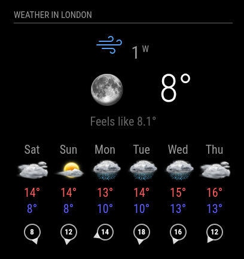
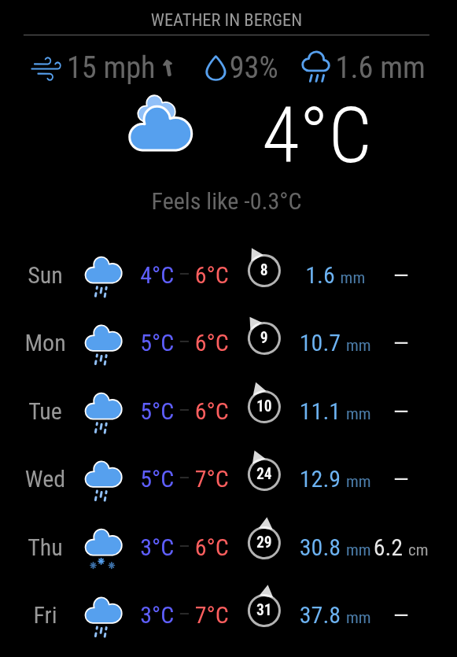
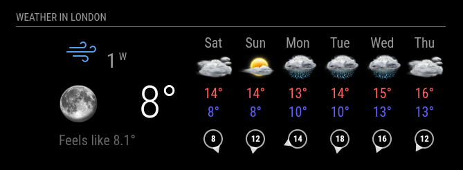
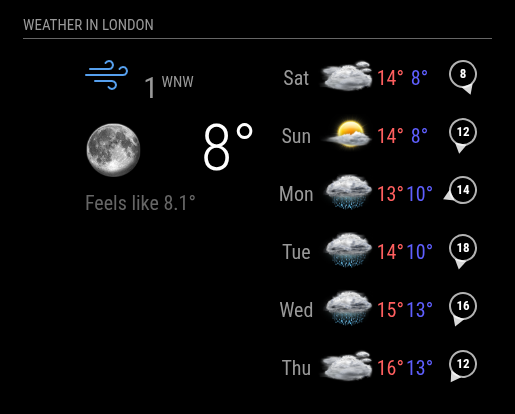
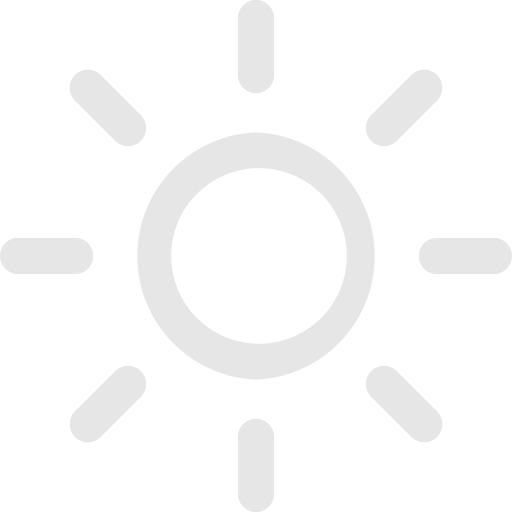
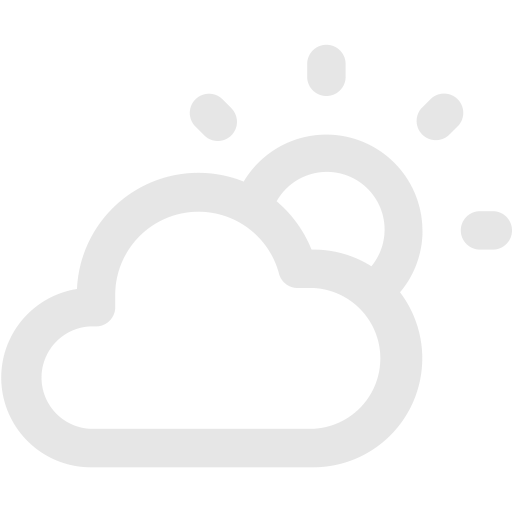
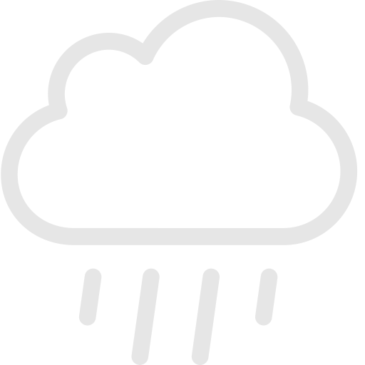
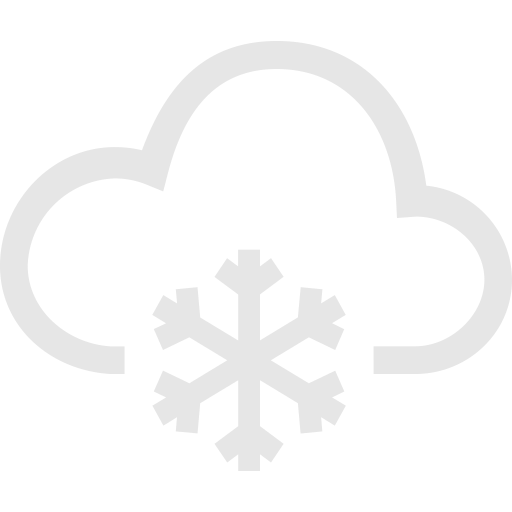
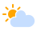

# MMM-OneCallWeather

This is a weather module for [MagicMirror²](https://github.com/MagicMirrorOrg/MagicMirror). It displays the weather forecast for the coming week - spanning from left to right, each day with its own icon and details,like the minimum and maximum temperature.

It is based somewhat around <https://github.com/jharttech/MMM-weatherforecast> and the default 'weather' app.

The software is designed around a display in Celsius and miles per hour, but should work in a multitude of units.

The app uses data from the currently-free source of openweathermap.org, using their one-call API - <https://openweathermap.org/api/one-call-api>.

## Project status

Since the original author of the module, [Captsi](https://github.com/Captsi), is no longer active, I forked the module. I fixed a few issues and will try to keep the module working in the future.

**This module is in maintenance mode.** So I'm not planning any functional changes. If someone wants to take over the further development, I would be happy. PR's are welcome too!

## Screenshots

**Vertical arrangement with columns layout**



**Vertical arrangement with rows layout**



**Horizontal arrangement with columns layout**



**Horizontal arrangement with rows layout**



## Installation

In your terminal, go the modules directory:

```sh
cd ~/MagicMirror/modules
```

Clone this repository:

```sh
git clone https://github.com/KristjanESPERANTO/MMM-OneCallWeather
```

Go to <https://openweathermap.org/api> and subscribe to One Call API. Its free to set up an account, and the free subscription level is fine for this app. The API returns a lot of information and can return 1000 calls a day on the free subscription level (approx once every 2 minutes maximum). The API is good as it uses their algorithms to give ultra local weather reports, even if you don't live in a named location, which some other apps suffer with.

Go to <https://www.latlong.net/> and figure out where you want the forecast for. There are plenty of ways of figuring out your location, and you just need a decimal format of your position. 52N 010W becomes 52.0 -10.0 on the two lines in your config.

## Update

Go to the module’s directory and pull the latest version:

```bash
cd ~/MagicMirror/modules/MMM-OneCallWeather
git pull
```

## Configuration

To use this module, add it to the modules array in the `config/config.js` file:

```javascript
    {
      module: "MMM-OneCallWeather",
      position: "top_right",
      header: "Weather in London",
      config: {
        latitude: "51.500149",  // Longitude from https://www.latlong.net/
        longitude: "-0.126240", // Longitude from https://www.latlong.net/
        apikey: "YOUR_API_KEY", // openweathermap.org API key
        iconset: "9a",          // Icon set to use.
        iconsetFormat: "svg",   // File format of the icons.
      }
    },
```

### Configuration options

The following properties can be configured:

| Option             | Description                                                                                                                                                                                                                                                                                                                                                                                            |
| ------------------ | ------------------------------------------------------------------------------------------------------------------------------------------------------------------------------------------------------------------------------------------------------------------------------------------------------------------------------------------------------------------------------------------------------ |
| `latitude`         | The latitude of the location used for weather information.<br><br>**Example:** `'51.500149'`<br>**Default value:** `false`<br><br>Value is **REQUIRED**                                                                                                                                                                                                                                                |
| `longitude`        | The longitude of the location used for weather information.<br><br>**Example:** `-0.126240`<br><br>**Note:** - (minus sign) is West + (plus, or no minus sign) is East of the prime meridian in London. To find your location you can go to latlong.net, or use google maps. If no value is entered for either lat or long the module will not work. Value is **REQUIRED**                             |
| `apikey`           | The [OpenWeatherMap](https://home.openweathermap.org) API key, which can be obtained by creating an OpenWeatherMap account.<br><br>Value is **REQUIRED**                                                                                                                                                                                                                                               |
| `apiVersion`       | The OpenWeatherMap API version to use.<br><br>**Default value:** `3.0`                                                                                                                                                                                                                                                                                                                                 |
| `units`            | What units to use for temperature.<br><br>**Possible values:** `config.units` = Specified by `config.js`, `"kelvin"` = Kelvin, `"metric"` = Celsius, `"imperial"` = Fahrenheit<br>**Default value:** `config.units`                                                                                                                                                                                    |
| `windUnits`        | The units to use for wind speed.<br><br>**Possible values:** `"mph"` (miles per hour), `"kmph"` (kilometers per hour), `"ms"` (meters per second)<br>**Default value:** `"mph"`<br>This value is optional. By default the weatherforecast module will display wind speed in miles per hour.                                                                                                            |
| `roundTemp`        | Round temperature values to nearest integer.<br><br>**Possible values:** `true` (round to integer) or `false` (display exact value with decimal point)<br>**Default value:** `false`                                                                                                                                                                                                                   |
| `showCurrent`      | Show the current weather section.<br><br>**Possible values:** `true` or `false`<br>**Default value:** `true`                                                                                                                                                                                                                                                                                           |
| `showAlerts`       | Show weather alerts from the OpenWeatherMap API in the current weather section. Displays the alert event names (e.g., "Severe Thunderstorm Warning"). Multiple alerts are shown on separate lines.<br><br>**Possible values:** `true` or `false`<br>**Default value:** `false`<br>**Note:** Alerts are only available with certain OpenWeatherMap API plans and for locations where alerts are issued. |
| `showForecast`     | Show the forecast section.<br><br>**Possible values:** `true` or `false`<br>**Default value:** `true`                                                                                                                                                                                                                                                                                                  |
| `forecastLayout`   | Defines how the forecast is structured internally.<br><br>**Possible values:** `"columns"` (days displayed as table columns), `"rows"` (days displayed as table rows)<br>**Default value:** `"columns"`                                                                                                                                                                                                |
| `arrangement`      | How current weather and forecast are positioned relative to each other (only relevant when both `showCurrent` and `showForecast` are `true`).<br><br>**Possible values:** `"vertical"` (forecast below current weather), `"horizontal"` (forecast next to current weather)<br>**Default value:** `"vertical"`                                                                                          |
| `showRainAmount`   | Should the predicted rain amount be displayed?<br><br>**Possible values:** `true` or `false`<br>**Default value:** `false`<br>This value is optional. By default the weatherforecast module will not display the predicted amount of rain.                                                                                                                                                             |
| `updateInterval`   | How often does the content needs to be fetched? (Milliseconds)<br><br>**Possible values:** `1000` - `86400000`<br>**Default value:** `600000` (10 minutes). The free subscription level currently allows a call every 2 minutes.                                                                                                                                                                       |
| `animationSpeed`   | Speed of the update animation. (Milliseconds)<br><br>**Possible values:** `0` - `5000`<br>**Default value:** `1000` (1 second)                                                                                                                                                                                                                                                                         |
| `iconset`          | The icon set to use.<br><br>**Possible values:** `"4a"`, `"8a"`, `"8b"` or `"9a"` any other directory of icons in the MMM-OneCallWeather/icons directory.<br>**Default value:** `"4a"`.                                                                                                                                                                                                                |
| `iconsetFormat`    | The format of the symbols in the above iconset directories. The module can't parse the filetype of the icons so you have to tell it what type it is. MagicMirror is pretty flexible with image types. If you have some funky icons try them out<br><br>**Possible values:** `"png"`, `"svg"` or any other image file type.<br>**Default value:** `"png"`.                                              |
| `decimalSymbol`    | The decimal symbol to use.<br><br>**Possible values:** `"."`, `","` or any other symbol.<br>**Default value:** `"."`                                                                                                                                                                                                                                                                                   |
| `fade`             | Fade the future events to black. (Gradient)<br><br>**Possible values:** `true` or `false`<br>**Default value:** `true`                                                                                                                                                                                                                                                                                 |
| `initialLoadDelay` | The initial delay before loading. If you have multiple modules that use the same API key, you might want to delay one of the requests. (Milliseconds)<br><br>**Possible values:** `1000` - `5000`<br>**Default value:** `2500` (2.5 seconds delay. This delay is used to keep the OpenWeather API happy.)                                                                                              |
| `tableClass`       | Name of the classes issued from `main.css`.<br><br>**Possible values:** `"xsmall"`, `"small"`, `"medium"`, `"large"`, `"xlarge"`<br>**Default value:** `"small"`                                                                                                                                                                                                                                       |
| `colored`          | If set 'colored' to true the min-temp get a blue tone and the max-temp get a red tone.<br><br>**Default value:** `true`                                                                                                                                                                                                                                                                                |

## Icon sets

You can use any of your own icons but you will have to rename them to the weather items shown on openweather. There are only 9 types of weather that the API currently shows (2025) and they are shown on <https://openweathermap.org/weather-conditions>. With some different icons for day and night you should have 18 icons in each directory, some of which will just be copies.

### Built-in icon sets

The module comes with four sets of icons

#### 4a: VClouds Weather Icons

- Author: Created and copyrighted by VClouds <https://www.deviantart.com/vclouds>
- License: [CC BY-NC-SA 3.0](https://creativecommons.org/licenses/by-nc-sa/3.0/). The icons are free to use for Non-Commercial use.
- Source: <https://www.deviantart.com/vclouds/art/VClouds-Weather-Icons-179152045>
- File format: PNG

##### Examples

<div style="background-color: black; padding: 10px;">
  
  
  
  
  
  
</div>

#### 8a: Weather Icons Static

- Source: <https://github.com/Makin-Things/weather-icons>
- License: [MIT](icons/8a/LICENSE.md)
- File format: SVG

##### Examples

<div style="background-color: black; padding: 10px;">
  
  
  
  
  
  
</div>

#### 8b: Open Weather Weather Icons

- Source: <https://github.com/isneezy/open-weather-icons>
- License: [MIT](icons/8b/LICENSE.md)
- File format: SVG

##### Examples

<div style="background-color: black; padding: 10px;">
  
  
  
  
  
  
</div>

#### 9a: Weather Icons Animated

- Source: <https://github.com/Makin-Things/weather-icons>
- License: [MIT](icons/9a/LICENSE.md)
- File format: SVG

##### Examples

<div style="background-color: black; padding: 10px;">
  
  
  
  
  
  
</div>

## Special Thanks

- [Michael Teeuw](https://github.com/MichMich) for creating the inspiring project [MagicMirror²](https://github.com/MagicMirrorOrg/MagicMirror).
- [Captsi](https://github.com/Captsi) for initiating this module and maintaining it until 2021.
- [Jason Hartgraves](https://github.com/jharttech) for creating the module [MMM-weatherforecast](https://github.com/jharttech/MMM-weatherforecast) on which a part of this module is based.
- The community of magicmirror.builders for help in the development process and all contributors for finding and fixing errors in this module.

## Contributing

If you find any problems, bugs or have questions, please [open a GitHub issue](https://github.com/KristjanESPERANTO/MMM-OneCallWeather/issues) in this repository.

Pull requests are of course also very welcome 🙂

### Code of Conduct

Please note that this project is released with a [Contributor Code of Conduct](CODE_OF_CONDUCT.md). By participating in this project you agree to abide by its terms.

### Developer commands

- `npm install` - Install development dependencies.
- `node --run lint` - Run linting and formatter checks.
- `node --run lint:fix` - Fix linting and formatter issues.
- `node --run test` - Run linting and formatter checks + run spelling check.
- `node --run test:spelling` - Run spelling check.
